# **Full Agent Stack — Cloud SQL (PostgreSQL) + WS Gateway + Firebase Auth Demo**

> A fully self-contained architecture for securely running **ephemeral CLI agents** on Kubernetes with authenticated WebSocket streaming, PostgreSQL session state, and Firebase user login.
> Built to feel like **App Engine for AI jobs** — you upload code, it builds via Cloud Build, deploys to GKE, and runs isolated sessions on demand.

---

## 🚀 Overview

This stack enables **user-authenticated, on-demand compute sessions** that run short-lived CLIs (e.g., LLM agents, data pipelines, RL environments) inside ephemeral Kubernetes Jobs.
Each user session:

1. Authenticates via **Firebase Auth** (Google or email/password).
2. Calls `POST /api/sessions` on the **controller**, which:

   * Verifies Firebase ID token.
   * Spawns a **Kubernetes Job** for that user.
   * Stores `{sessionId → podIP}` in **PostgreSQL (Cloud SQL)**.
   * Mints a short-lived **RS256 session-JWT**.
3. The browser opens a WebSocket to the **WS Gateway**, passing that JWT.

   * The gateway verifies JWT → looks up podIP in Postgres → proxies WS traffic to the runner.
4. The **runner** downloads a CLI bundle (zip/tgz/git), verifies checksum, installs dependencies, and streams output through **ttyd**.
5. The **frontend** (Firebase Auth + xterm.js) shows the live CLI stream in-browser.

---

## 🧩 Architecture Diagram

```mermaid
flowchart LR
  subgraph Client["Frontend (Browser)"]
    A1["Firebase Auth (ID Token)"]
    A2["xterm.js Terminal"]
  end
  subgraph GKE["GKE Autopilot Cluster (Private VPC)"]
    C1["Controller API"]
    G1["WS Gateway"]
    R1["Ephemeral Runner Pod (ttyd)"]
    DB["Cloud SQL Proxy Sidecar"]
  end
  SQL["Cloud SQL (PostgreSQL)"]
  FA["Firebase Project"]

  A1 -->|"ID Token"| C1
  C1 -->|"spawn Job"| R1
  C1 -->|"insert session → podIP"| SQL
  C1 -->|"mint JWT"| A2
  A2 -->|"JWT via WebSocket"| G1
  G1 -->|"lookup podIP"| SQL
  G1 -->|"WS proxy"| R1
  DB --> SQL
```



---

## ⚙️ Components

### **1. Controller**

* Express API verifying Firebase ID tokens.
* Creates Kubernetes Jobs (one per session).
* Inserts session metadata and **one-time JTI** into PostgreSQL.
* Mints **RS256 JWTs** signed by a private key from a K8s secret.
* Exposes a public **`/.well-known/jwks.json`** endpoint for token verification.

### **2. WebSocket Gateway**

* Stateless Node.js proxy layer.
* Verifies session JWTs against the controller's public **JWKS endpoint**.
* **Prevents JTI replay attacks** by checking/deleting the JTI in Postgres.
* Fetches podIP from Postgres.
* Streams WS traffic (client ⇄ runner).
* Scales horizontally; use GCLB ingress.

### **3. Runner**

* Minimal Node + bash + ttyd image.
* Pulls bundle from `CODE_URL` (zip/tgz/git).
* Verifies optional SHA-256.
* Runs inside isolated Job; TTL cleans up after finish.
* Streams output through ttyd at `:7681`.

### **4. Database (PostgreSQL on Cloud SQL)**

* **`sessions`** (UNLOGGED): `session_id`, `owner_user_id`, `job_name`, `pod_ip`, `expires_at`.
* **`token_jti`** (UNLOGGED): prevents JWT reuse (one-time tokens).
* Trigger `prune_expired_rows()` cleans out expired sessions/JTIs automatically.

### **5. Frontend (Firebase Auth + xterm.js)**

* Sign in with Google or email/password.
* Calls `/api/sessions` with ID token.
* Connects WS to gateway with protocol `bearer,<sessionJWT>`.
* Streams live job output in terminal.

### **6. Cloud Build**

* `cloudbuild.yaml` builds all three images (controller, gateway, runner) directly from source.
* Pushes to Artifact Registry, then applies K8s manifests via `envsubst`.
* Short TTL + cleanup policies keep repo slim.

---

## 🧱 Infrastructure (Terraform)

Directory: `infra/`

Creates a secure, private foundation for the application:

* **Dedicated VPC** (`ws-cli-vpc`) with a subnet for GKE.
* **Private GKE Autopilot cluster** with no public control plane endpoint.
* **Private Cloud SQL (Postgres 15)** instance accessible only from within the VPC.
* **Artifact Registry** repo with a 7-day cleanup policy for untagged images.
* Enables required GCP APIs.

Example use:

```bash
cd infra
terraform init
terraform apply \
  -var="project_id=YOUR_PROJECT" \
  -var="region=us-central1" \
  -var="db_user=appuser" \
  -var="db_password=STRONG_PASSWORD"
```

Outputs:

* `instance_connection_name` for the Cloud SQL proxy.
* `db_user` and `db_name` for configuring the application.

Connect to the private database instance using the Cloud SQL Auth Proxy:

```bash
# First, get the connection name from terraform output
export INSTANCE_CONNECTION_NAME=$(terraform -chdir=infra output -raw instance_connection_name)

# In a separate terminal, start the proxy
gcloud sql connect ws-cli-pg --instance-connection-name=$INSTANCE_CONNECTION_NAME

# Now you can connect using psql
psql "host=127.0.0.1 port=5432 sslmode=disable dbname=wscli user=appuser"
> \i ../db/schema.sql
```

---

## ☸️ Kubernetes Deployment (via Terraform & Helm)

The entire application, including all Kubernetes resources, is now deployed using the **Helm** provider within Terraform. This simplifies deployment by removing the need for manual `kubectl` commands and `envsubst`.

The Helm chart is located in the `cliscale-chart/` directory. Terraform renders this chart and deploys it to the GKE cluster.

### Configuration

All configuration is now managed through Terraform variables. You will need to provide values for the following in your `terraform apply` command or a `.tfvars` file:

*   `domain`: The public domain for the controller API (e.g., `cliscale.yourdomain.com`).
*   `ws_domain`: The public domain for the WebSocket Gateway (e.g., `ws.yourdomain.com`).
*   `controller_image_tag`: The Docker image tag for the controller.
*   `gateway_image_tag`: The Docker image tag for the gateway.

### Deploying the Application

After initializing Terraform, run the `apply` command with the required variables:

```bash
cd infra
terraform init
terraform apply \
  -var="project_id=YOUR_PROJECT" \
  -var="region=us-central1" \
  -var="db_user=appuser" \
  -var="db_password=STRONG_PASSWORD" \
  -var="domain=cliscale.yourdomain.com" \
  -var="ws_domain=ws.yourdomain.com" \
  -var="controller_image_tag=latest" \
  -var="gateway_image_tag=latest"
```

Terraform will provision the GKE cluster, Cloud SQL instance, and then deploy the application using the Helm chart.

---

## 🧪 Local Testing (Firebase Auth + WebSocket)

1. Open `frontend/index.html`.
   Replace placeholders with your Firebase config:

   ```js
   const firebaseConfig = {
     apiKey: "AIza...",
     authDomain: "yourapp.firebaseapp.com",
     projectId: "yourapp",
     appId: "1:123456789:web:abcdef"
   };
   ```
2. Start a static server:

   ```bash
   npx http-server frontend -p 3000
   ```
3. Sign in → fill `controller` (https) and `gateway` (wss) URLs with the domains you configured in Terraform.
4. Provide:

   * `code_url`:  a zip or Git repo
   * `command`:   what to run (e.g., `npm run build && node dist/index.js run`)
   * `prompt`:    text prompt to send to Claude
5. Click **Run Session** → watch live terminal stream.

---

## 🔒 Security Model

| Layer             | Mechanism                                                    | Purpose                                    |
| ----------------- | ------------------------------------------------------------ | ------------------------------------------ |
| User → Controller | Firebase ID token                                            | Authenticates human identity               |
| Controller → User | Short-lived **RS256 Session JWT** w/ **one-time JTI**        | Grants single-session access               |
| Gateway           | **JWT verify via JWKS** + **JTI replay prevention** (Postgres) | Authorizes WS upgrade and prevents reuse   |
| Runner            | TTL Job + NetworkPolicy                                      | Hard isolation per user                    |
| DB                | **Private IP** + Expiry trigger + unlogged tables            | Secure, fast writes, and auto-cleanup      |

### Additional Hardening (Recommended)

* Replace local PEMs with **Cloud KMS-backed** keys for signing.
* Implement **VPC-SC** restrictions for an extra security boundary.
* Use **Cloud Armor** to rate-limit `/api/sessions` and protect from DDoS.
* Add robust bundle validation (domain allowlists, size limits, static analysis).

---

## 📈 Scalability Notes

* Gateway pods handle ~30–60 KB/socket → ~1 M idle sockets ≈ 40–60 GB across 40–80 pods.
* BackendConfig: `timeoutSec: 3600–7200`, enable pings.
* Job TTL: 5–10 min typical; reclaim resources fast.
* Horizontal Pod Autoscaler or KEDA on custom metric `open_ws_connections`.
* Cloud SQL connection pool per pod (e.g., `max=5`) avoids exhaustion.

---

## 🧠 Observability

Add (GCP managed Prometheus + Cloud Logging):

* Controller API latency.
* Job spin-up time.
* Active sessions / WS connections.
* Runner job CPU, memory, duration.

Use OpenTelemetry SDKs to emit traces to GCP Trace for end-to-end session profiling.

---

## 🪄 Developer Experience

### Build/Deploy Workflow

* **No local Docker required** — Cloud Build uploads code, builds, and deploys.
* **Short-lived Artifact Registry**: images expire automatically after 7 days.
* **Ephemeral CLI**: runner downloads from URL; you can swap versions instantly.

### Sample CLI

The bundled `sample-cli/` shows:

* Stage-wise progress bars with `listr2` + `ora`.
* Claude API integration (`@anthropic-ai/sdk`).
* Works inside runner via ttyd or local Node.

---

## 🧰 Folder Structure

```
full-agent-stack-pg-sql/
├── README.md
├── infra/                  # Terraform (Cloud SQL + GKE + Helm Deployment)
├── db/schema.sql           # Sessions + JTIs + expiry triggers
├── cliscale-chart/         # Helm chart for the application
├── controller/             # Express API + Firebase verify + JWT mint + JWKS
├── ws-gateway/             # Stateless WS proxy + JWT verify
├── runner/                 # Entry script + Dockerfile (downloads bundle)
├── sample-cli/             # Stage-wise CLI sample (listr2 + ora)
└── frontend/               # Firebase Auth + xterm.js demo UI
```

---

## ✅ Quickstart Recap

| Step                      | Command                                                  |
| ------------------------- | -------------------------------------------------------- |
| 1️⃣ Build Images          | `gcloud builds submit --config cloudbuild.yaml`          |
| 2️⃣ Deploy Infra & App    | `cd infra && terraform apply` (with variables)           |
| 3️⃣ Init DB schema        | `psql "host=127.0.0.1 port=5432 sslmode=disable dbname=wscli user=appuser" -f db/schema.sql` (after starting proxy) |
| 4️⃣ Run frontend          | `npx http-server frontend -p 3000`                       |
| 5️⃣ Sign in & Run session | via browser UI                                           |

---

## 🧩 Future Extensions

* **pg_cron** cleanup every 5 min to prune expired sessions/JTIs.
* **Custom CA mTLS** between gateway↔runner for intra-cluster TLS.
* **Multi-tenant billing** (store token usage or duration per session).
* **OpenTelemetry** spans linking Firebase UID ↔ Job runtime.

